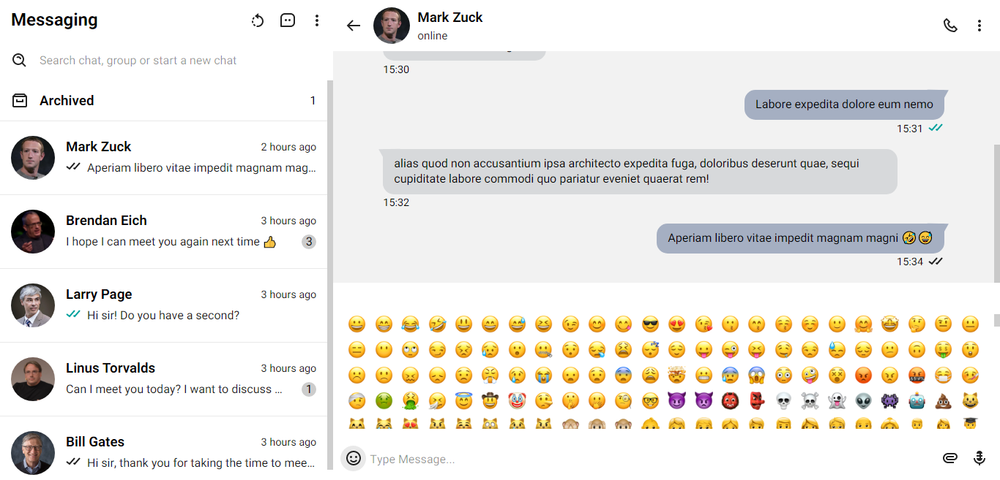
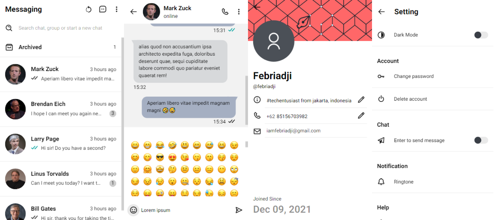
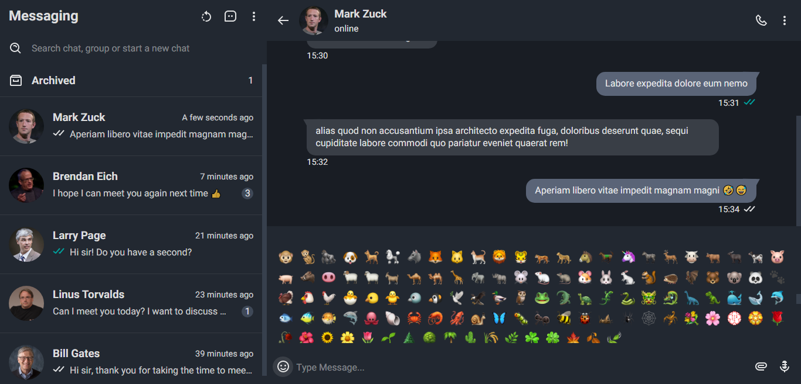
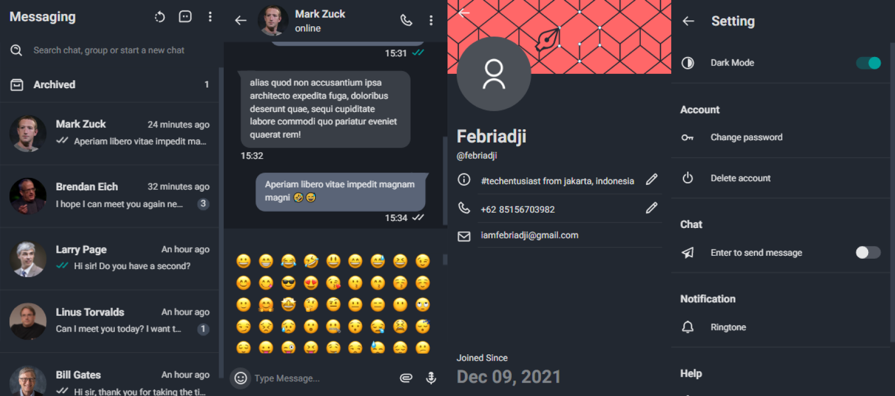

# Messaging App

It's a free and open source 🌐 web-based instant messaging application. With this application users can send messages and exchange photos 📷, videos 🎥, stickers, audio 🎵 and other types of files.

The stack of technologies I used to create this app, includes:
- [Node.js](https://nodejs.org/en) & [Express.js](https://expressjs.com)
- [Socket.io](https://socket.io)
- [React.js](https://reactjs.org) & [Redux](https://redux.js.org)
- [MongoDB](https://www.mongodb.com)

# Getting Started
~~~
$ git clone https://github.com/febriadj/messaging-app

$ cd messaging-app/ && code .
~~~
Clone this project to your local repository, then go to your project folder.

~~~
$ mv .env.example .env
~~~
Rename the `.env.example` file to `.env`, then adjust the environment to your needs.

~~~
$ npm install
~~~
Install all dependencies on this project.

~~~
$ npm run dev
~~~
Run the app in development mode. then open http://localhost:3000 in the browser.

# Screenshot 📸

# Contributing
Contributions make the open source community a great place to learn, inspire and create. I really appreciate every contribution you make.

If you have any suggestions that would make this even better, please fork  this repo and pull request. You can also open an issue on this project and don't forget to give this project a star. Thank you.

- Fork this project
- Create a new branch (git checkout -b branchName)
- Commit your changes (git commit -m "Add new features")
- Push to your branch (git push origin branchName)
- Submit a pull request

# License 📄
Distributed under the MIT License. See [LICENSE.txt](https://github.com/febriadj/messaging-app/blob/master/LICENSE) for more information.

# Contact
LinkedIn: [linkedin.com/in/febri-adji](https://www.linkedin.com/in/febri-adji)

Phone: +62 851-5670-3982\
Email: <iamfebriadji@gmail.com>